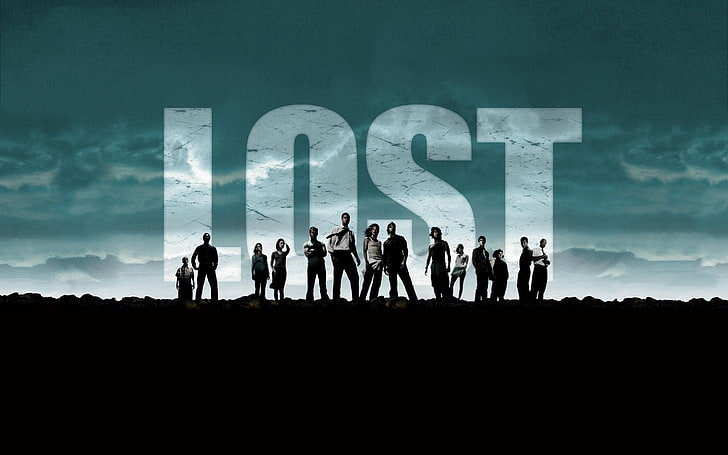

# The Storyteller - Lost TV Series Fan Website
# Description

The Storyteller is an interactive fan website dedicated to the iconic TV series "Lost". This project serves as a comprehensive resource for fans, providing detailed information about characters, episodes, and the show's rich mythology. The website features an intuitive interface that allows users to explore the series' content, save their favorite episodes, and engage with other fans through a contact system.

# Table of Contents
- [Installation](#installation)
- [Usage](#usage)
- [Features](#features)
- [Credits](#credits)

# Installation
1. Clone the repository to your local machine:
   ```bash
   git clone https://github.com/yourusername/the-storyteller.git
   ```
2. Navigate to the project directory:
   ```bash
   cd the-storyteller
   ```
3. Open the project in your preferred code editor.
4. Launch the website by opening `index.html` in your web browser.

# Usage
The Storyteller website is designed to be user-friendly and intuitive. Here's how to use its main features:

# Homepage


- The homepage features a dynamic slideshow showcasing key moments from the series
- Navigate through the slideshow using the arrow buttons or dots
- Use the search bar to find specific episodes or content

# Character Profiles


- Browse through detailed profiles of main characters
- Click on character images to view more information
- Use the "Show/Hide Main Characters" button to toggle the character section

# Saved Items

- Save your favorite episodes and characters for quick access
- View all saved items in the dedicated "Saved" section
- Remove items from your saved list as needed

# Contact Form

- Reach out through the contact form for feedback or questions
- Fill in your details and message
- Submit your inquiry for a response

# Features

- Interactive slideshow with key series moments
- Detailed character profiles with images and descriptions
- Episode search functionality
- Save system for favorite content
- Responsive design for all devices
- Contact form for user feedback

# Credits

# Development

- **Noah Mashaba** - Lead Developer
  - GitHub:https://github.com/NoahandtheArk
  - Email: mashanoah@icloud.com

# Content Sources

- Lost TV Series (ABC Studios)
- Character information from official Lost wiki
- Images sourced from official Lost promotional materials

# Special Thanks

- The Lost fan community for inspiration
- ABC Studios for creating the original series

Made with love for Lost and other interesting TV Series an Movies fans everywhere
